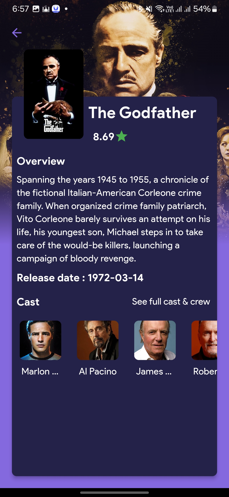

# Wazflix

Wazflix App adalah aplikasi mobile yang menampilkan daftar film populer serta informasi detail terkait film tersebut seperti pemain, rating, sinopsis, dan lainnya. Aplikasi ini dirancang menggunakan Flutter dan memanfaatkan API film eksternal untuk mendapatkan data.

## Fitur

- **Daftar Film Populer**: Lihat daftar film populer dengan poster dan judul.
- **Detail Film**: Klik pada film untuk melihat detail termasuk sinopsis, daftar pemain, dan rating.
- **Pencarian Film**: Cari film berdasarkan judul.
- **Penyaringan Berdasarkan Genre**: Filter film berdasarkan genre seperti aksi, komedi, drama, dll.
- **Pemain Film**: Lihat informasi tentang para aktor/aktris yang berperan di setiap film.

## Screenshots

<!-- Letakkan screenshot aplikasi di sini -->




## Teknologi yang Digunakan

- **Flutter**: Framework untuk pengembangan aplikasi mobile multiplatform.
- **Dart**: Bahasa pemrograman yang digunakan oleh Flutter.
- **API Film (TMDb)**: Mengambil data film dari The Movie Database (TMDb).
- **Provider**: State management untuk memisahkan logic dengan UI.

## Cara Instalasi

1. **Clone repository**:

   ```bash
   git clone https://github.com/fawwazmw/wazflix.git
   cd MovieListApp
   ```

2. **Install Dependencies**

   ```
   flutter pub get
   ```

3. **Jalankan Aplikasi**

   ```
   flutter run
   ```

4. **API Key**
   ```
   TMDB_API_KEY=your_api_key_here
   ```

## Struktur Folder

lib/
│
├── models/ # Model data untuk film, pemain, dan lainnya
├── services/ # File untuk memanggil API
├── providers/ # State management untuk film dan detail film
├── screens/ # Tampilan UI aplikasi
├── widgets/ # Komponen widget yang digunakan berulang kali
└── main.dart # Entry point aplikasi

## API yang Digunakan

- **The Movie Database (TMDb)**: Lihat daftar film populer dengan poster dan judul.

## Kontribusi

Kami sangat terbuka terhadap kontribusi untuk mengembangkan aplikasi ini lebih baik lagi. Berikut adalah langkah-langkah untuk berkontribusi:

- 1. Fork repository ini.
- 2. Buat branch fitur baru (git checkout -b feature/AmazingFeature).
- 3. Commit perubahan Anda (git commit -m 'Add some AmazingFeature').
- 4. Push ke branch (git push origin feature/AmazingFeature).
- 5. Buat Pull Request.

## Lisensi

Aplikasi ini dilisensikan di bawah MIT License.

## Penjelasan:

- **Fitur**: Menyebutkan fitur utama aplikasi seperti daftar film, detail pemain, dan rating.
- **Instalasi**: Menjelaskan langkah-langkah untuk meng-clone repository, menginstal dependencies, dan menjalankan aplikasi.
- **API Key**: Menjelaskan penggunaan API dari TMDb dan bagaimana menambahkan API key.
- **Struktur Folder**: Menjelaskan struktur folder dalam proyek Flutter.
- **Kontribusi**: Menyediakan panduan untuk berkontribusi ke proyek.
- **Lisensi**: Disertakan lisensi, di sini saya menggunakan MIT sebagai contoh.

**a.** Apakah kamu ingin menambahkan lebih banyak informasi seperti panduan penggunaan fitur dalam aplikasi?  
**b.** Apakah kamu memerlukan contoh implementasi API TMDb di dalam aplikasi?
